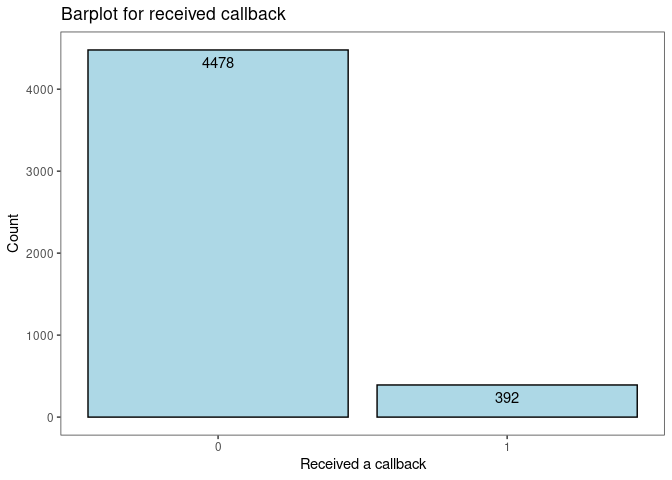
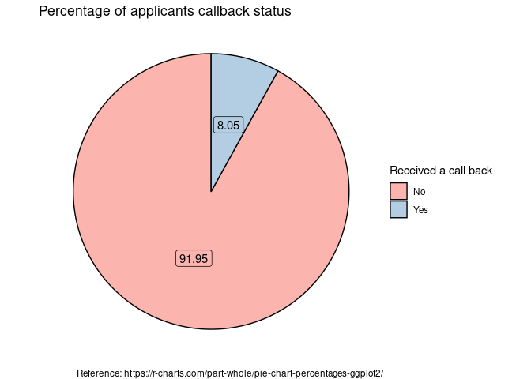

Activity 6 - Logistic Regression
================

# Activity 6 - Day 1

## Task 2: Load the necessary packages

``` r
library(tidyverse)
library(tidymodels) 
library(lessR)
```

## Task 3: Load the data

``` r
resume<-read_csv("https://www.openintro.org/data/csv/resume.csv",show_col_types = FALSE)
```

1.  I think this is an experimental study because they have monitored
    and kept track of the job applications call back rates

2.  I think the variable “received\_callback” was a numeric variable
    (More of a binary variable). The value “o” represents that the
    applicant did not get a call back and the value “1” represents that
    the applicant got a call back for the job application.

``` r
# Adding a new varibale called condition to show whether the applicant received a call back

resume<-resume %>% mutate(condition=ifelse(resume$received_callback=="1","Yes","No"))
```

``` r
# creating barplot visualization for the received_callback variable

plot1<-resume%>%ggplot(aes(x=received_callback))+
  geom_bar(fill = "lightblue", colour = "black")+
  geom_text(aes(label=..count..),stat = "count",vjust=1.6)+
  scale_x_continuous(breaks = c(0,1))+
  labs(title = "Barplot for received callback",
       x="Received a callback",
       y="Count")+
  theme(plot.title = element_text(hjust = 0.5))

plot1
```

<!-- -->

3.  I have choosen a bar plot to visulaize the numerical summary of
    applicants callback status which you can see above.

4.  Below is the numerical summary table that I have recreated and also
    a pie chart to visualize the numerical summary table

``` r
# Creating a summary table to display the numerical summary table of the applicants callback status

summary_table <- resume %>% 
  group_by(condition) %>% # Variable to be transformed
  count() %>% 
  ungroup() %>% 
  mutate(percent = (`n` / sum(`n`))*100)%>%
  mutate(across(where(is.numeric), round, 2))

print.data.frame(summary_table)
```

    ##   condition    n percent
    ## 1        No 4478   91.95
    ## 2       Yes  392    8.05

``` r
# Creating a piechart to visualize applicants condition of received callback

plot2<-ggplot(summary_table, aes(x = "", y = percent, fill = condition)) +
  geom_col(color = "black") +
  geom_label(aes(label = percent), color = "black",
            position = position_stack(vjust = 0.5),
            show.legend = FALSE) +
  labs(title = "Percentage of applicants callback status",
       caption = "Reference: https://r-charts.com/part-whole/pie-chart-percentages-ggplot2/")+
  guides(fill = guide_legend(title = "Received a call back")) +
  scale_fill_brewer(palette = "Pastel1")+
  coord_polar(theta = "y") + 
  theme_void()

plot2
```

<!-- -->

5.  According to the results of 3 and 4, the majority of applicants
    (91.95%) did not receive a callback for their application, while
    only a few applicants (8.05%) did.

## Task 4: Probability and odds

6.  The probability that a randomly selected résumé/person will be
    called back is **0.08**

7.  The odds that a randomly selected résumé/person will be called back
    is **0.087**

## Task 5: Logistic regression

8.  The probability that a randomly selected résumé/person perceived as
    Black will be called back is **0.032**

9.  The odds that a randomly selected résumé/person perceived as Black
    will be called back is **0.033**

``` r
# The {tidymodels} method for logistic regression requires that the response be a factor variable
resume <- resume %>% 
  mutate(received_callback = as.factor(received_callback))

resume_mod <- logistic_reg() %>%
  set_engine("glm") %>%
  fit(received_callback ~ race, data = resume, family = "binomial")

tidy(resume_mod) %>% 
  knitr::kable(digits = 3)
```

| term        | estimate | std.error | statistic | p.value |
|:------------|---------:|----------:|----------:|--------:|
| (Intercept) |   -2.675 |     0.083 |   -32.417 |       0 |
| racewhite   |    0.438 |     0.107 |     4.083 |       0 |

10. The estimated regression equation is

$$
 \begin{aligned}
\widehat{\texttt{received\_callback}}&= \hat{\beta}_0 + \hat{\beta}_1 \times \texttt{race}\\
&= -2.675 + 0.438   \times \text{race}
\end{aligned}
$$

**Note:** Since the Race variable is a categorical variable with two
levels, R has created a dummy variable for race in the model. So if the
applicant is perceived as “Black” then race is “0” and if the applicant
is perceived it as “white” then race is “1”.

$$
 \begin{aligned}
\widehat{\texttt{received\_callback}}&= -2.675 + 0.438  \times \text{race} \\
&= 2.675 + 0.438(0) \\
\widehat{\texttt{received\_callback}}&= -2.675
\end{aligned}
$$
