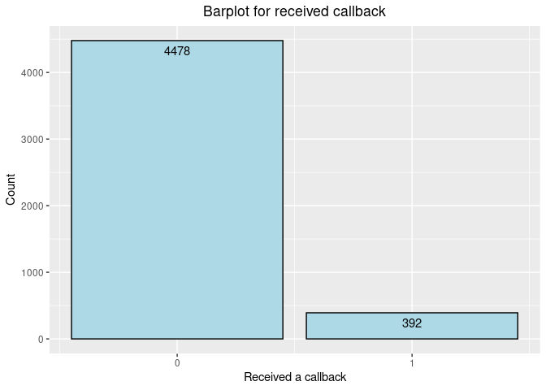

Activity 6 - Logistic Regression
================

# Activity 6 - Day 1

## Task 2: Load the necessary packages

``` r
library(tidyverse)
library(tidymodels) 
```

## Task 3: Load the data

``` r
resume<-read_csv("https://www.openintro.org/data/csv/resume.csv",show_col_types = FALSE)
```

1.  I think this is an experimental study because they have monitored
    and kept track of the job applications call back rates

2.  I think the variable “received\_callback” was a numeric variable
    (More of a binary variable). The value “o” represents that the
    applicant did not get a call back and the value “1” represents that
    the applicant got a call back for the job application.

``` r
# creating visualization for the received_callback variable

plot1<-resume%>%ggplot(aes(x=received_callback))+
  geom_bar(fill = "lightblue", colour = "black")+
  geom_text(aes(label=..count..),stat = "count",vjust=1.6)+
  scale_x_continuous(breaks = c(0,1))+
  labs(title = "Barplot for received callback",
       x="Received a callback",
       y="Count")+
  theme(plot.title = element_text(hjust = 0.5))

plot1
```

<!-- -->

3.  I have choosen bar plot as an appropriate visualization for the
    variable “received\_callback” which you can see above.

``` r
callback_table<-table(resume$received_callback)
callback_table
```

    ## 
    ##    0    1 
    ## 4478  392
